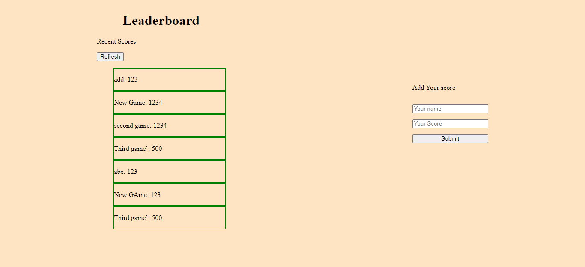

# leaderboard
> The leaderboard website displays scores submitted by different players. It also allows you to submit your score. All data is preserved thanks to the [external Leaderboard API ](https://www.notion.so/microverse/Leaderboard-API-service-24c0c3c116974ac49488d4eb0267ade3)service.

For this application the priority is to create a working version of the leaderboard that preserves user input. 
Here is the list of project milstones:

Milstone 1: basic page structure.
Milstone 2: send and receive data from API.
Milstone 3: final touches.

## Live Link:
[live link](https://ahzia.github.io/leaderboard/)

## Built With

- HTML, CSS, JS

## Getting Started
To get a local copy up and running follow these simple example steps.

### Prerequisites
Node.js, git 
### Setup
Clone the project 
`$ git clone https://github.com/ahzia/leaderboard/`
### Install
Install dependencies `$ npm install`
### Usage
If you want to build the project `$ npm run build` - this will build the project in /dist folder
Start the Project `$ npm start` - serve the project in browser
### Deployment
Project has been deployed to Github pages, You can modify the configuration and deploy it to your favroite server

## Authors

👤 **Author1**

- GitHub: [@ahzia](https://github.com/ahzia)
- Twitter: [@ZiaYousofi](https://twitter.com/ZiaYousofi)
- LinkedIn: [Ahmad zia Yousufi](https://https://www.linkedin.com/in/ah-ziayosfi)

## 🤝 Contributing

Contributions, issues, and feature requests are welcome!

Feel free to check the [issues page](../../issues/).

## Show your support

Give a ⭐️ if you like this project!

## Acknowledgments

- Miroverse.org for assigning me this project and amzaing code reviwers 

## 📝 License

This project is [MIT](./MIT.md) licensed.
